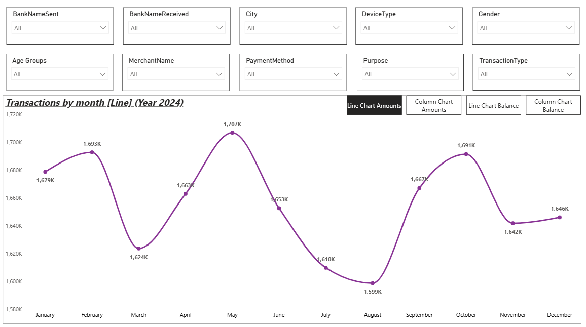
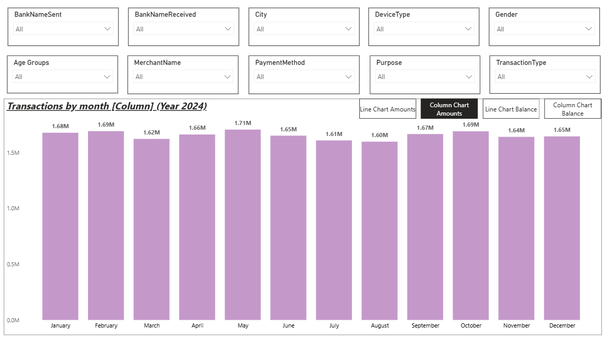
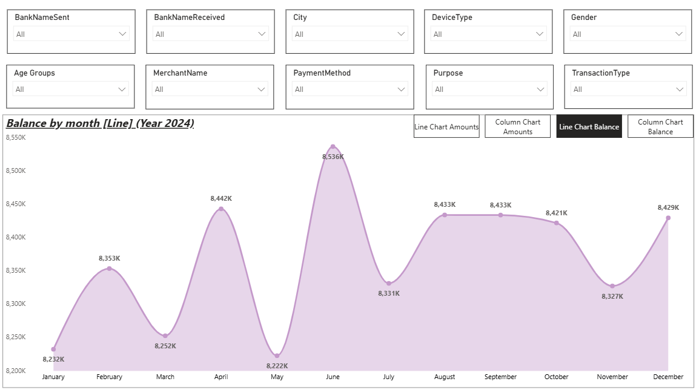
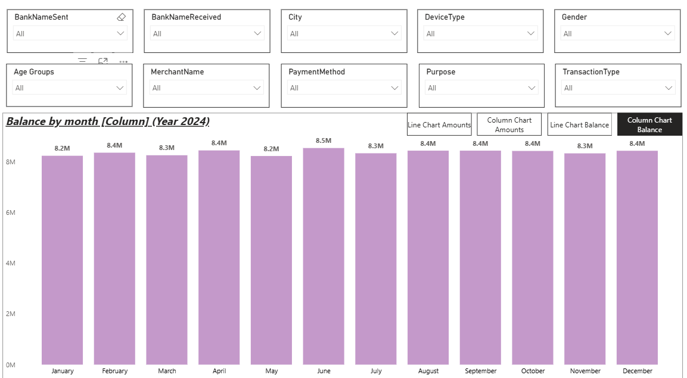
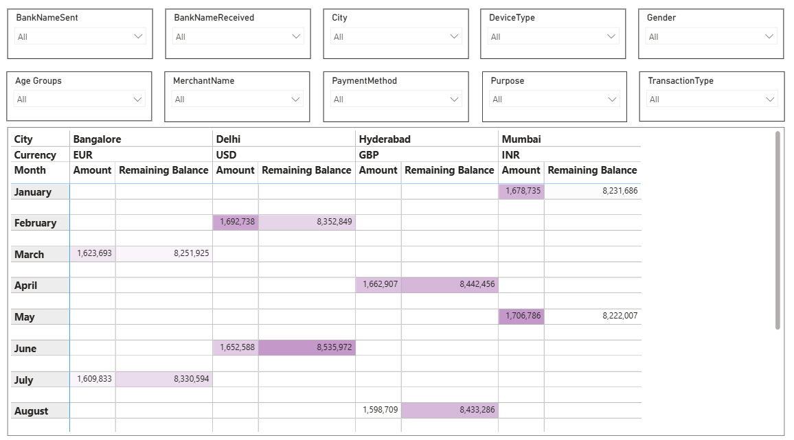

# 💳 UPI Transaction Analysis – Monthly Trends, Balances & User Behavior Dashboard

An interactive **Power BI dashboard** built on a **UPI transaction dataset** to analyze monthly transaction amounts, remaining balances, and transaction behavior across cities, banks, and payment attributes.  
This project helps understand digital payment trends and user behavior in a real-world UPI ecosystem.

---

## 🎯 Project Objective
To analyze UPI transaction data and track:
- Monthly transaction volume and balance trends  
- Variations in transaction behavior across cities and banks  
- Impact of payment methods, devices, and user demographics  
- Overall usage patterns of UPI transactions during 2024  

---

## 📸 Dashboard Preview

---

## 🛠️ Tech Stack
- **Power BI** – Dashboard development & visualization  
- **DAX** – Measures for transaction amounts and balances  
- **Power Query** – Data cleaning & transformation  
- **Excel / CSV** – Source dataset  

---

## 📂 Dataset Used
🔗 [UPI Transactions Dataset](Data/UPI_Transactions.xlsx)

---

## ⭐ Features
- Monthly transaction analysis using line and column charts  
- Monthly balance trends visualization  
- City-wise transaction and balance comparison table  
- Multi-currency representation across cities  
- Interactive slicers for banks, city, device type, payment method, purpose, gender, age group, and transaction type  
- Clean, intuitive, and user-friendly dashboard layout  

---

## 🔗 Dashboard File
Download the full Power BI project:  
📁 [UPI_Transactions_Project.pbix](Dashboard/UPI_Transactions_Project.pbix)

---

## 🔄 Process / Workflow
- Cleaned and structured raw UPI transaction data using Power Query  
- Created DAX measures for transaction totals and remaining balances  
- Designed monthly trend visuals for transactions and balances  
- Built city-wise comparison tables for detailed insights  
- Added interactive slicers for dynamic data exploration  

---

## 🔍 Project Insights
- Transaction volumes show noticeable monthly fluctuations throughout the year.  
- Remaining balances vary significantly across cities and months.  
- Certain months show spikes in transaction activity, indicating seasonal trends.  
- City-wise analysis highlights differences in spending and balance behavior.  
- Interactive filters help quickly identify patterns across user segments.  

---

## 🧾 Final Conclusion
This UPI Transactions dashboard provides a comprehensive view of digital payment behavior by combining transaction trends, balance analysis, and demographic filters.  
It enables data-driven insights into UPI usage patterns and supports better understanding of modern digital payment systems.

---
